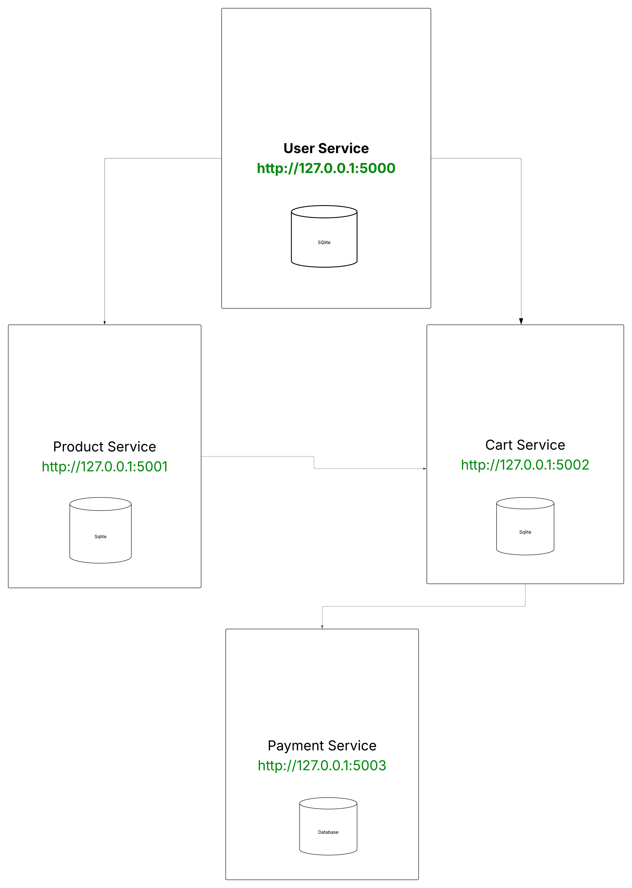

# HashKart

### User Service
> http://127.0.0.1:5000

### Product Service
> http://127.0.0.1:5001

### Cart Service
> http://127.0.0.1:5002

### Payment Service
> http://127.0.0.1:5003

## Architecture Diagram

## Usage

### virtual environment

* pip install virtualenv 
* virtualenv venv   
* venv\Scripts\activate

### run app

* pip install -r requirements.txt
* flask db init
* flask db migrate -m "create tables"
* flask db upgrade

#### User Service
> flask run --port=5000
#### Product Service
> flask run --port=5001 
#### Cart Service
> flask run --port=5002
#### Payment Service
> flask run --port=5003